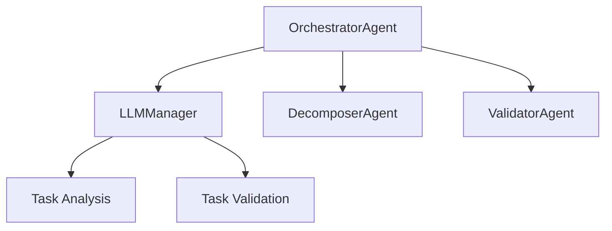
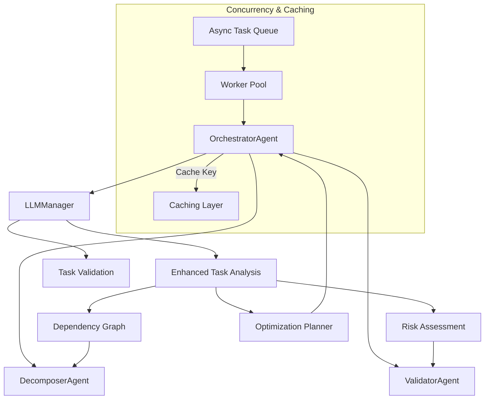

# Task Analysis and Validation Architecture Implementation Plan (Updated)

This document provides a **complete blueprint** for improving the **Sygus Planner** project’s **task analysis and validation architecture**, incorporating **concurrency management**, **caching**, **robust error handling**, **risk-based gating**, **versioning strategies**, and **performance** considerations. It preserves and extends the original plan, ensuring a junior developer can fully implement the discussed features.

---

## Table of Contents

1. [Overview](#overview)  
2. [Architecture Changes](#architecture-changes)  
   1. [Current Architecture](#current-architecture)  
   2. [Enhanced Architecture](#enhanced-architecture)  
3. [Implementation Steps](#implementation-steps)  
   1. [Update LLMManager Prompt Types](#1-update-llmmanager-prompt-types)  
   2. [Introduce Concurrency and Caching](#2-introduce-concurrency-and-caching)  
   3. [Update OrchestratorAgent](#3-update-orchestratoragent)  
   4. [Add Validation Layer](#4-add-validation-layer)  
   5. [Update Integration Points](#5-update-integration-points)  
4. [Testing Plan](#testing-plan)  
   1. [Unit Tests](#1-unit-tests)  
   2. [Integration Tests](#2-integration-tests)  
   3. [Load and Performance Testing](#3-load-and-performance-testing)  
5. [Migration Guide](#migration-guide)  
   1. [Prerequisites](#1-prerequisites)  
   2. [Migration Steps](#2-migration-steps)  
   3. [Breaking Changes](#3-breaking-changes)  
   4. [Rollback Plan](#4-rollback-plan)  
6. [Monitoring and Metrics](#monitoring-and-metrics)  
7. [Support and Troubleshooting](#support-and-troubleshooting)  

---

## Overview

The goal is to strengthen the **LLM-based task analysis**, enhance error handling, introduce concurrency management, and reinforce the integration between components. By **caching** LLM results, we reduce redundant calls, and a **risk-based gating** mechanism ensures critical tasks receive extra validation. A new **validation layer** enforces schema integrity, while a **versioning strategy** helps manage evolving data contracts.

---

## Architecture Changes

### Current Architecture



### Enhanced Architecture

Below is the updated architecture, adding **concurrency**, **caching**, and **risk gating**:



- **Async Task Queue** & **Worker Pool**: Allows multiple tasks to be processed in parallel.  
- **Caching Layer**: Stores and retrieves LLM results keyed by task signature.  
- **Risk Gating**: If `Risk Assessment` indicates high risk, the system enforces extra validations before continuing.

---

## Implementation Steps

### 1. Update LLMManager Prompt Types

#### 1.1 Add New Task Analysis Prompt

```python
# src/llm/manager.py

class LLMManager:
    def __init__(self):
        self.prompts = {
            "task_analysis_v2": {
                "system": """You are a task analysis expert. Analyze the given task to provide comprehensive insights about its structure, dependencies, risks, and optimization opportunities.

Your response must be a valid JSON object with the following structure:
{
    "analysis": {
        "task_type": string,  // e.g., "build", "test", "deploy"
        "complexity": {
            "level": string,  // "low", "medium", "high"
            "factors": array<string>,
            "score": number  // 1-10 scale
        },
        "dependencies": {
            "external": array<string>,
            "internal": array<{from: string, to: string}>,
            "resources": array<string>
        },
        "risks": {
            "potential_failures": array<{
                "type": string,
                "likelihood": string,
                "impact": string,
                "mitigation": string
            }>,
            "bottlenecks": array<string>
        },
        "optimization": {
            "parallelization": array<string>,
            "caching": array<string>,
            "resource_management": array<string>
        }
    },
    "metadata": {
        "confidence_score": number,  // 0-1 scale
        "analysis_version": string,
        "timestamp": string
    }
}""",
                "user": """Please analyze the following task with special attention to:
1. Dependencies and their order
2. Potential risks and mitigation strategies
3. Optimization opportunities
4. Resource requirements

Task details:
{task_details}

Additional context:
{context}"""
            },
            "validate_dag": {
                "system": "...",
                "user": "..."
            }
            # Add other prompt types if needed
        }

    async def get_llm_response(self, prompt_type: str, **kwargs) -> Dict[str, Any]:
        """Public method to retrieve an LLM response using a specific prompt."""
        try:
            if prompt_type not in self.prompts:
                raise LLMError(f"Unknown prompt type: {prompt_type}")

            # Validate and extract content
            content = self._validate_and_extract_content(prompt_type, kwargs)
            
            # Format prompt
            formatted_prompt = self._format_prompt(prompt_type, content)

            # Handle robust error retries (example using tenacity)
            return await self._get_llm_response_with_retry(prompt_type, formatted_prompt)
        except Exception as e:
            self.logger.error(f"Error in get_llm_response: {str(e)}")
            raise LLMError(f"Failed to get LLM response: {str(e)}")

    def _validate_and_extract_content(self, prompt_type: str, kwargs: Dict) -> Dict:
        """Validate and extract content based on prompt type requirements."""
        required_keys = {
            "task_analysis_v2": ["task_details", "context"],
            "validate_dag": ["tasks", "validation_requirements"],
        }
        
        if prompt_type not in required_keys:
            raise LLMError(f"No content validation defined for prompt type: {prompt_type}")
            
        content = {}
        for key in required_keys[prompt_type]:
            if key not in kwargs:
                raise LLMError(f"Missing required key '{key}' for prompt type '{prompt_type}'")
            content[key] = kwargs[key]
            
        return content

    @retry(wait=wait_exponential(min=1, max=10), stop=stop_after_attempt(3))
    async def _get_llm_response_with_retry(self, prompt_type: str, formatted_prompt: str) -> Dict[str, Any]:
        """
        Internal method that actually calls the LLM with retry logic.
        Adjust 'stop_after_attempt' and 'wait_exponential' to meet your needs.
        """
        # This is where you actually invoke the LLM (e.g., via Anthropic Claude or OpenAI).
        # For instance:
        # response = await self._call_anthropic_api(formatted_prompt)
        # return response

        # Placeholder:
        return {"analysis": {}, "metadata": {}}

    def _format_prompt(self, prompt_type: str, content: Dict[str, Any]) -> str:
        """
        Construct the final prompt string by substituting the user content
        into the system and user templates.
        """
        system_template = self.prompts[prompt_type]["system"]
        user_template = self.prompts[prompt_type]["user"]

        final_prompt = f"{system_template}\n\n{user_template}"
        return final_prompt
```

> **Note**: `tenacity` is used here for retry logic. If you prefer a simpler approach, you can manually implement try-except with exponential backoff.

---

### 2. Introduce Concurrency and Caching

#### 2.1 Concurrency

You can integrate an **async queue** and a **worker pool** in your system so tasks can be processed in parallel:

```python
# src/concurrency/task_queue.py

import asyncio

class TaskQueue:
    def __init__(self, worker_count: int = 4):
        self.queue = asyncio.Queue()
        self.worker_count = worker_count

    async def start_workers(self, worker_fn):
        """Start a pool of workers that process items from the queue."""
        tasks = []
        for _ in range(self.worker_count):
            tasks.append(asyncio.create_task(self._worker_loop(worker_fn)))
        await asyncio.gather(*tasks)

    async def _worker_loop(self, worker_fn):
        """Continuously get tasks from the queue and process them."""
        while True:
            item = await self.queue.get()
            try:
                await worker_fn(item)
            except Exception as e:
                # Log or handle error
                pass
            finally:
                self.queue.task_done()

    async def enqueue_task(self, task_data):
        """Add task data to the queue."""
        await self.queue.put(task_data)
```

> **Usage**:  
> - Implement `worker_fn` to call your `OrchestratorAgent` logic.  
> - Start the queue in your main application with `await task_queue.start_workers(your_worker_fn)`.

#### 2.2 Caching

Implement a simple cache interface and use Redis or an in-memory solution:

```python
# src/caching/interface.py

import abc
from typing import Dict, Any, Optional

class CacheInterface(abc.ABC):
    @abc.abstractmethod
    async def set(self, key: str, value: Dict[str, Any]) -> None:
        pass

    @abc.abstractmethod
    async def get(self, key: str) -> Optional[Dict[str, Any]]:
        pass


# src/caching/memory_cache.py

class InMemoryCache(CacheInterface):
    def __init__(self):
        self._store = {}

    async def set(self, key: str, value: Dict[str, Any]) -> None:
        self._store[key] = value

    async def get(self, key: str) -> Optional[Dict[str, Any]]:
        return self._store.get(key)

# Example for Redis-based caching (requires `redis` library):
"""
import aioredis

class RedisCache(CacheInterface):
    def __init__(self, url="redis://localhost:6379"):
        self.redis = aioredis.from_url(url)

    async def set(self, key: str, value: Dict[str, Any]) -> None:
        await self.redis.set(key, json.dumps(value))

    async def get(self, key: str) -> Optional[Dict[str, Any]]:
        data = await self.redis.get(key)
        return json.loads(data) if data else None
"""
```

---

### 3. Update OrchestratorAgent

#### 3.1 Enhance Task Analysis Method

```python
# src/agents/orchestrator.py

from src.caching.interface import CacheInterface
from src.validation.task_analysis import TaskAnalysisValidator

class OrchestratorAgent(BaseAgent):
    def __init__(self, llm_manager, state_manager, cache: CacheInterface):
        super().__init__()
        self.llm_manager = llm_manager
        self.state_manager = state_manager
        self.cache = cache

    async def get_llm_task_analysis(self, tasks: List[dict]) -> Dict:
        """Get comprehensive LLM analysis of the high-level tasks."""
        try:
            # Prepare context
            context = {
                "environment": self.state_manager.get_current_state().environment,
                "previous_executions": self.state_manager.get_execution_history(),
                "system_resources": await self._get_system_resources()
            }

            # Compute a cache key by hashing the tasks + context
            cache_key = self._compute_cache_key(tasks, context)
            cached_result = await self.cache.get(cache_key)
            if cached_result:
                self.logger.info("Returning cached analysis result.")
                return cached_result

            # No cache match => proceed with LLM call
            llm_response = await self.llm_manager.get_llm_response(
                prompt_type="task_analysis_v2",
                task_details=tasks,
                context=context
            )

            # Validate and process the analysis
            processed_analysis = await self._process_task_analysis(llm_response)

            # Store in cache
            await self.cache.set(cache_key, processed_analysis)

            # Update state with analysis results
            await self._update_state_with_analysis(processed_analysis)

            return processed_analysis
        except Exception as e:
            self.logger.error(f"Task analysis failed: {e}")
            await self._handle_analysis_failure(e)
            raise

    async def _process_task_analysis(self, analysis: Dict) -> Dict:
        """Process and validate the task analysis results."""
        validator = TaskAnalysisValidator()
        if not validator.is_valid(analysis):
            raise ValueError(f"Invalid task analysis: {validator.errors}")

        # Implement risk gating
        potential_failures = analysis["analysis"]["risks"]["potential_failures"]
        high_risk_items = [
            item for item in potential_failures if item.get("impact") == "high"
        ]
        if high_risk_items:
            self.logger.warning("High-risk tasks detected. Triggering extra validation steps.")
            # Additional gating logic or manual approval can go here.

        # Possibly add version or transform older analysis versions to the latest schema
        enhanced_analysis = await self._enhance_analysis(analysis)
        await self._log_analysis_insights(enhanced_analysis)

        return enhanced_analysis

    def _compute_cache_key(self, tasks: List[dict], context: Dict) -> str:
        """Generate a deterministic cache key from tasks & context."""
        import hashlib, json
        raw = json.dumps({"tasks": tasks, "context": context}, sort_keys=True)
        return hashlib.sha256(raw.encode('utf-8')).hexdigest()

    async def _handle_analysis_failure(self, error: Exception):
        # Custom logic for handling analysis failures
        pass

    async def _update_state_with_analysis(self, analysis: Dict):
        # Persist the analysis results in some state manager or database
        pass

    async def _enhance_analysis(self, analysis: Dict) -> Dict:
        # Optionally add more metadata or do post-processing
        analysis["metadata"]["post_processed"] = True
        return analysis

    async def _log_analysis_insights(self, analysis: Dict):
        # Log any relevant insights
        self.logger.info("Analysis Insights: %s", analysis)
```

---

### 4. Add Validation Layer

#### 4.1 Create Task Analysis Validator

```python
# src/validation/task_analysis.py

from pydantic import BaseModel, Field
from typing import List, Dict, Optional
from enum import Enum

class ComplexityLevel(str, Enum):
    LOW = "low"
    MEDIUM = "medium"
    HIGH = "high"

class Risk(BaseModel):
    type: str
    likelihood: str
    impact: str
    mitigation: str

class Complexity(BaseModel):
    level: ComplexityLevel
    factors: List[str]
    score: int = Field(ge=1, le=10)

class Dependencies(BaseModel):
    external: List[str]
    internal: List[Dict[str, str]]
    resources: List[str]

class Risks(BaseModel):
    potential_failures: List[Risk]
    bottlenecks: List[str]

class Optimization(BaseModel):
    parallelization: List[str]
    caching: List[str]
    resource_management: List[str]

class Analysis(BaseModel):
    task_type: str
    complexity: Complexity
    dependencies: Dependencies
    risks: Risks
    optimization: Optimization

class Metadata(BaseModel):
    confidence_score: float = Field(ge=0, le=1)
    analysis_version: str
    timestamp: str

class TaskAnalysis(BaseModel):
    analysis: Analysis
    metadata: Metadata

class TaskAnalysisValidator:
    def __init__(self):
        self.errors = []

    def is_valid(self, analysis_dict: Dict) -> bool:
        try:
            TaskAnalysis(**analysis_dict)
            return True
        except Exception as e:
            self.errors = str(e)
            return False
```

---

### 5. Update Integration Points

#### 5.1 Decomposer Integration

```python
# src/agents/decomposer.py

class DecomposerAgent(BaseAgent):
    async def decompose_task(self, task: Dict, analysis: Optional[Dict] = None) -> List[PrimitiveTask]:
        """Decompose a task using analysis insights if available."""
        if analysis:
            # Use analysis to guide decomposition
            return await self._guided_decomposition(task, analysis)
        else:
            # Fallback to standard decomposition
            return await self._standard_decomposition(task)

    async def _guided_decomposition(self, task: Dict, analysis: Dict) -> List[PrimitiveTask]:
        """Use analysis insights to guide task decomposition."""
        try:
            complexity = analysis["analysis"]["complexity"]
            dependencies = analysis["analysis"]["dependencies"]
            risks = analysis["analysis"]["risks"]

            # If complexity is high, we might break the task into more granular steps
            if complexity["level"] == "high":
                return await self._complex_task_decomposition(task, dependencies)
            else:
                return await self._simple_task_decomposition(task, dependencies)
        except Exception as e:
            self.logger.error(f"Guided decomposition failed: {e}")
            # Fallback to standard decomposition
            return await self._standard_decomposition(task)

    async def _complex_task_decomposition(self, task: Dict, dependencies: Dict) -> List[PrimitiveTask]:
        # Detailed logic to handle multi-step tasks
        # Possibly map out sub-tasks in parallel if analysis.optimization.parallelization is not empty
        return []

    async def _simple_task_decomposition(self, task: Dict, dependencies: Dict) -> List[PrimitiveTask]:
        # Basic decomposition
        return []

    async def _standard_decomposition(self, task: Dict) -> List[PrimitiveTask]:
        # Original logic without analysis
        return []
```

---

## Testing Plan

### 1. Unit Tests

#### 1.1 Test Task Analysis Validation

```python
# tests/test_task_analysis.py

import pytest
from src.validation.task_analysis import TaskAnalysisValidator

def test_task_analysis_validation():
    valid_analysis = {
        "analysis": {
            "task_type": "build",
            "complexity": {
                "level": "high",
                "factors": ["multiple dependencies", "resource intensive"],
                "score": 8
            },
            "dependencies": {
                "external": ["docker", "npm"],
                "internal": [{"from": "build", "to": "test"}],
                "resources": ["CPU", "Memory"]
            },
            "risks": {
                "potential_failures": [{
                    "type": "resource_exhaustion",
                    "likelihood": "medium",
                    "impact": "high",
                    "mitigation": "implement resource limits"
                }],
                "bottlenecks": ["disk I/O"]
            },
            "optimization": {
                "parallelization": ["unit tests"],
                "caching": ["npm packages"],
                "resource_management": ["implement build cache"]
            }
        },
        "metadata": {
            "confidence_score": 0.85,
            "analysis_version": "2.0",
            "timestamp": "2024-01-02T14:51:27-06:00"
        }
    }
    
    validator = TaskAnalysisValidator()
    assert validator.is_valid(valid_analysis)

def test_invalid_task_analysis():
    invalid_analysis = {
        "analysis": {
            "task_type": "build",
            # Missing required fields
        }
    }
    
    validator = TaskAnalysisValidator()
    assert not validator.is_valid(invalid_analysis)
```

### 1.2 Test Caching

```python
# tests/test_caching.py

import pytest
import asyncio
from src.caching.memory_cache import InMemoryCache

@pytest.mark.asyncio
async def test_in_memory_cache():
    cache = InMemoryCache()
    key = "test_key"
    value = {"foo": "bar"}

    await cache.set(key, value)
    retrieved = await cache.get(key)
    assert retrieved == value
```

### 2. Integration Tests

```python
# tests/test_integration.py

import pytest
from src.agents.orchestrator import OrchestratorAgent
from src.llm.manager import LLMManager
from src.caching.memory_cache import InMemoryCache

@pytest.mark.asyncio
async def test_task_analysis_integration():
    cache = InMemoryCache()
    llm_manager = LLMManager()
    orchestrator = OrchestratorAgent(llm_manager, state_manager=None, cache=cache)

    test_task = {
        "id": "test_task",
        "type": "build",
        "command": "npm build",
        "dependencies": ["install"]
    }
    
    analysis = await orchestrator.get_llm_task_analysis([test_task])
    assert "analysis" in analysis
    assert "metadata" in analysis

@pytest.mark.asyncio
async def test_guided_decomposition():
    cache = InMemoryCache()
    llm_manager = LLMManager()
    orchestrator = OrchestratorAgent(llm_manager, state_manager=None, cache=cache)
    decomposer = DecomposerAgent()

    test_task = {
        "id": "complex_build",
        "type": "build",
        "steps": ["install", "compile", "test"]
    }

    # Get analysis first
    analysis = await orchestrator.get_llm_task_analysis([test_task])
    # Use analysis in decomposition
    primitive_tasks = await decomposer.decompose_task(test_task, analysis)
    
    assert isinstance(primitive_tasks, list)
```

### 3. Load and Performance Testing

- **Load Testing**: Use a tool like `locust` or `pytest-benchmark` to simulate multiple tasks enqueued for concurrent processing.  
- **Profiling**: Monitor CPU, memory usage, and LLM latency under high load.  
- **Cache Hit Ratio**: Confirm that repeated tasks don’t constantly re-run expensive LLM calls.

---

## Migration Guide

### 1. Prerequisites

- **Python 3.8+**  
- **Updated Dependencies** in `requirements.txt` (including Pydantic, Tenacity, etc.)  
- **LLM API Access** (e.g., Anthropic Claude or OpenAI)

### 2. Migration Steps

1. **Update Dependencies**:
   ```bash
   pip install -r requirements.txt
   ```
2. **Apply Database Migrations** (if storing state or analysis versions in DB):
   ```bash
   python -m alembic upgrade head
   ```
3. **Add/Update Environment Variables**:
   ```bash
   cp .env.template .env
   # Include concurrency settings, Redis settings, LLM credentials, etc.
   ```
4. **Run All Tests**:
   ```bash
   pytest tests/
   ```
5. **Implement Worker Pool** (if desired):
   ```bash
   # Start concurrency queue and workers
   # e.g., in main.py
   from src.concurrency.task_queue import TaskQueue

   async def worker_fn(task_data):
       # e.g. call orchestrator methods
       ...

   async def main():
       task_queue = TaskQueue(worker_count=4)
       await task_queue.start_workers(worker_fn)
       # enqueue tasks as needed
   ```

### 3. Breaking Changes

1. **Task Analysis Response Format**:
   - Old format no longer supported.  
   - Update any calls that consume `get_llm_task_analysis` to handle the new JSON structure.
2. **Validation Requirements**:
   - All LLM responses must conform to the `TaskAnalysis` schema.  
   - Custom validators must match or extend this schema.
3. **Caching Logic**:
   - If code previously assumed each LLM call was always “fresh,” you may need to handle the possibility of a cached result.

### 4. Rollback Plan

1. **Code Rollback**:
   ```bash
   git checkout <previous_commit>
   ```
2. **Database Rollback** (if applicable):
   ```bash
   python -m alembic downgrade -1
   ```
3. **Disable Caching & Concurrency**:
   - Revert environment variables to prior settings or comment out concurrency/caching logic temporarily.

---

## Monitoring and Metrics

1. **Task Analysis Performance**  
   - Analysis duration, LLM response time, concurrency queue throughput.  
2. **Cache Effectiveness**  
   - Cache hit/miss ratio, average retrieval time.  
3. **Risk Gating Efficacy**  
   - How often tasks are flagged “high risk,” additional validations triggered.  
4. **Error Rates**  
   - LLM failures, validation failures, integration errors.  
5. **System Resource Utilization**  
   - CPU, memory usage, concurrency overhead under load.

---

## Support and Troubleshooting

1. **LLM Response Validation Failures**  
   - Verify that the LLM prompt string is well-formed.  
   - Check the logs for schema mismatch details (e.g., missing fields).  
2. **Cache Misses for Identical Tasks**  
   - Confirm that `_compute_cache_key()` consistently hashes the same data.  
   - Ensure the same environment/context is used for repeated tasks.  
3. **Concurrency Bottlenecks**  
   - Increase worker count or scale horizontally if the queue grows too large.  
   - Profile CPU usage to confirm the system can handle parallel tasks.  
4. **High-Risk Tasks Over-Triggering**  
   - Adjust the gating logic for “impact == high” if it’s too sensitive.  
   - Provide manual overrides or additional checks as needed.

---

